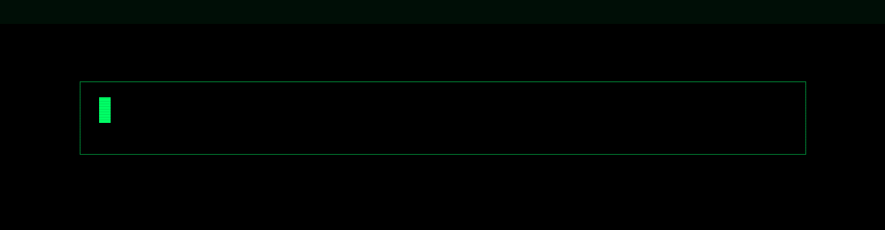

<div align="center">



<br>

```text
root@analyst:~# initialize_profile
[+] Identity loaded
[+] Data pipelines mounted
[+] Query engine online
[+] Access granted
```

### `Data Analyst // Data Science // Business Intelligence // Analytics`


<br>


</div>

---

<table>
<tr>
<td width="46%" valign="top">

<pre>
        DATA STREAM // LIVE

   value
    ^
100 |                          ####
 90 |                    ####  ####
 80 |              ####  ####  ####
 70 |        ####  ####  ####  ####
 60 |  ####  ####  ####  ####  ####
 50 |  ####  ####  ####  ####  ####
 40 |  ####  ####  ####  ####  ####
 30 |  ####  ####  ####  ####  ####
 20 |  ####  ####  ####  ####  ####
 10 |  ####  ####  ####  ####  ####
  0 +----------------------------------->
       Q1    Q2    Q3    Q4    Q5   time

   [ ETL ]---->[ CLEAN ]---->[ MODEL ]
       |            |             |
       v            v             v
   [ SQL ]      [ pandas ]   [ INSIGHT ]

   > correlation != causation
   > garbage in, garbage out
   > let the data speak._
</pre>

</td>

<td width="54%" valign="top">

<pre>
root@analyst
────────────────────────────────────────────

OS        AnalyticsOS x86_64
Host      Data Analyst
Kernel    Statistics / Data Science
Uptime    XX years

Role      Data Analyst
Sector    Business Intelligence
Location  Palmas, Tocantins, Brazil

Focus     Analytics • BI • Data Viz • ML
Shell     bash / Python REPL
Editor    VS Code / Jupyter

Code
├── Python
├── R
├── SQL
└── DAX

Data
├── PostgreSQL
├── MySQL
├── BigQuery
└── Parquet / CSV

Human Languages
├── Portuguese   Native
└── English      Technical / Learning

Status    [ ACCESS GRANTED ]
</pre>

</td>
</tr>
</table>

---

## `root@analyst:~/about# cat identity.txt`

```text
Data Analyst focused on turning raw data into decisions.

I work with data collection, cleaning, modeling and
visualization to answer real business questions.

My main areas of interest are Exploratory Data Analysis,
Business Intelligence, Statistics, Data Storytelling
and the first steps into Machine Learning.

I enjoy understanding what the numbers hide, why metrics
move, and how to communicate insights that people act on.
```

---

## `root@analyst:~/stack# ./enumerate.sh`

<div align="center">

### `> LANGUAGES`


### `> ANALYSIS & ML`


### `> VISUALIZATION & BI`


### `> DATA`


</div>

---

## `root@analyst:~/analytics# tree`

```text
analytics/
├── data-collection/
├── data-cleaning/
├── exploratory-analysis/
├── statistics/
├── data-visualization/
├── dashboards-bi/
├── machine-learning/
└── data-storytelling/
```

### `> TOOLKIT`

```text
[+] Python (pandas / numpy)
[+] SQL
[+] Jupyter Notebook
[+] Power BI
[+] Excel / Google Sheets
[+] scikit-learn
[+] Matplotlib / Seaborn / Plotly
[+] Git
```

---

## `root@analyst:~/projects# ./scan-projects.sh`

### `[01] Sales Dashboard & KPI Analysis`

```text
TYPE        Business Intelligence / Portfolio
TARGET      Sales performance & KPIs

MODULES
├── Data ingestion (CSV / SQL)
├── Cleaning & transformation (pandas)
├── KPI modeling
├── Interactive dashboard (Power BI)
└── Insights report
```

### `[02] Exploratory Data Analysis (EDA)`

```text
TYPE        Data Analysis / Academic
TARGET      Dataset exploration

MODULES
├── Data profiling
├── Missing value treatment
├── Distribution & correlation analysis
├── Outlier detection
└── Visual findings
```

---

## `root@analyst:~/learning# cat roadmap.yml`

```yaml
current_targets:
  - Exploratory Data Analysis
  - SQL (advanced queries)
  - Statistics for Data Science
  - Power BI / Dashboards
  - Data Storytelling
  - Machine Learning Fundamentals

certifications:

  completed:
    - Google Data Analytics (in progress / adjust)

  targets:
    - Microsoft PL-300 (Power BI Data Analyst)
    - Google Advanced Data Analytics
    - AWS / Azure Data Fundamentals
```

---

## `root@analyst:~/career# ./status.sh`

```text
[*] INITIALIZING CAREER MODULES...

[ OK ] Python
[ OK ] SQL
[ OK ] Data Cleaning
[ OK ] Data Visualization

[ >> ] Business Intelligence
[ >> ] Statistics
[ >> ] Machine Learning

[ .. ] PL-300
[ .. ] Advanced Analytics

--------------------------------------------
STATUS: LEARNING
MODE:   DATA-DRIVEN
--------------------------------------------
```

---

## `root@analyst:~/stats# ./github-intel.sh`

<div align="center">


</div>

---

## `root@analyst:~/activity# tail -f activity.log`

<div align="center">


<br><br>


</div>

---

## `root@analyst:~/network# cat contact.conf`

<div align="center">

[](https://github.com/Luckleal)

[](https://www.linkedin.com/in/SEU_PERFIL/)

</div>

---

<div align="center">

```text
root@analyst:~# ./mission.sh

[+] COLLECT
[+] CLEAN
[+] ANALYZE
[+] VISUALIZE
[+] DECIDE
[+] REPEAT

>> Never stop learning._
```

### `SESSION ACTIVE`

</div>
